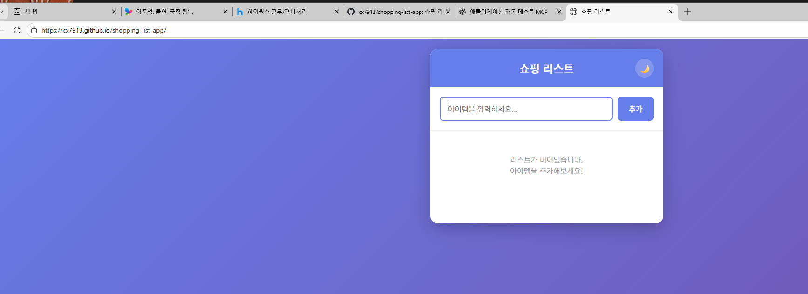

# 쇼핑 리스트 앱

Vanilla JavaScript로 구현된 쇼핑 리스트 웹 애플리케이션입니다.

## 스크린샷



## 데모

[https://cx7913.github.io/shopping-list-app/](https://cx7913.github.io/shopping-list-app/)

## 주요 기능

| 기능 | 설명 | 사용법 |
|------|------|--------|
| 아이템 추가 | 새 항목 추가 | 입력 후 Enter 또는 추가 버튼 |
| 아이템 체크 | 완료 표시 | 원형 체크박스 클릭 |
| 아이템 수정 | 텍스트 편집 | 항목 텍스트 더블클릭 |
| 아이템 삭제 | 개별 삭제 | × 버튼 클릭 |
| 순서 변경 | 드래그앤드롭 | ☰ 핸들 드래그 |
| 일괄 삭제 | 완료 항목 삭제 | "완료된 항목 삭제" 클릭 |
| 다크모드 | 테마 전환 | 헤더의 달/해 버튼 |
| 데이터 저장 | 자동 저장 | LocalStorage (새로고침 유지) |

## 기술 스택

- **HTML5** - 단일 파일 구조
- **CSS3** - CSS 변수로 다크모드 구현
- **Vanilla JavaScript** - 프레임워크 없음
- **Google Fonts** - Noto Sans KR (한글 폰트)
- **LocalStorage** - 클라이언트 데이터 저장

## 실행 방법

```bash
# 로컬 서버로 실행
npx serve .
# 또는
python3 -m http.server 8000

# 접속: http://localhost:3000 또는 http://localhost:8000
```

## 라이선스

MIT License
